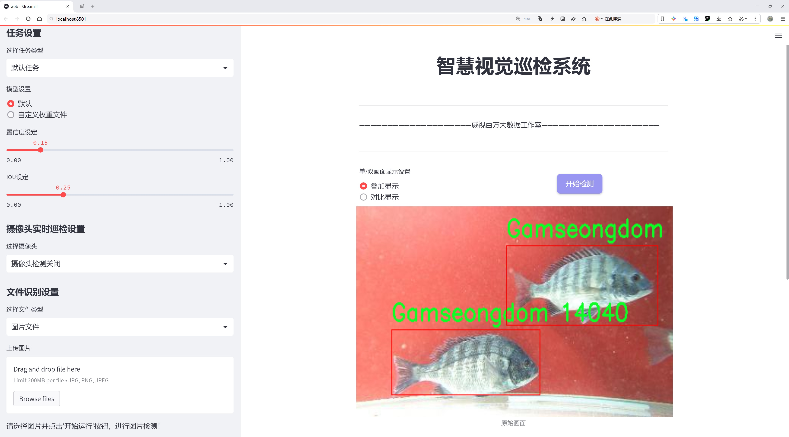
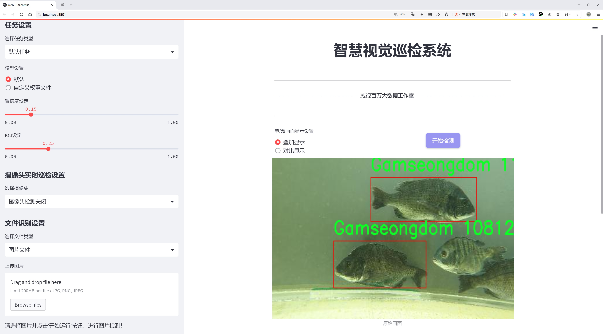
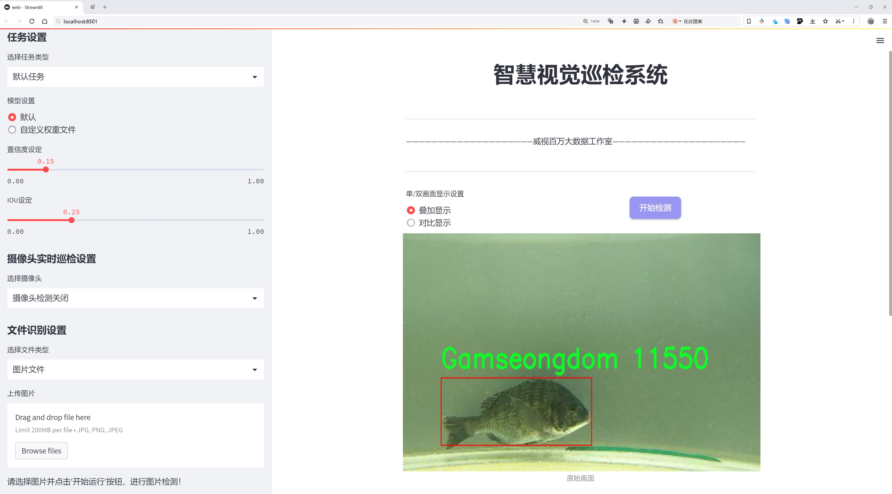
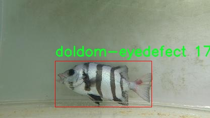
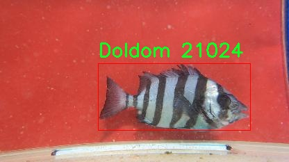
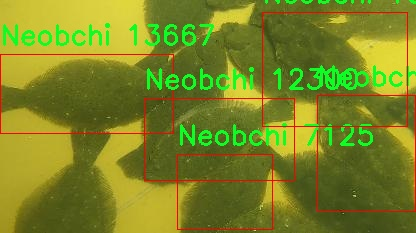
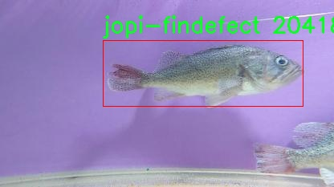
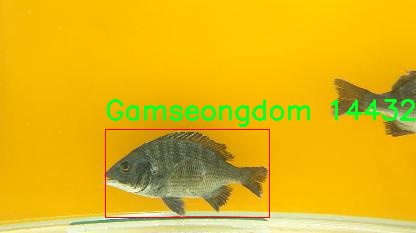

# 鱼类疾病检测检测系统源码分享
 # [一条龙教学YOLOV8标注好的数据集一键训练_70+全套改进创新点发刊_Web前端展示]

### 1.研究背景与意义

项目参考[AAAI Association for the Advancement of Artificial Intelligence](https://gitee.com/qunshansj/projects)

项目来源[AACV Association for the Advancement of Computer Vision](https://gitee.com/qunmasj/projects)

研究背景与意义

随着全球水产养殖业的快速发展，鱼类疾病的防控已成为确保水产品质量和安全的重要环节。鱼类疾病不仅影响养殖业的经济效益，还可能对生态环境造成负面影响。因此，及时、准确地检测和诊断鱼类疾病，对于提高养殖效率、降低经济损失、保护水域生态具有重要意义。传统的鱼类疾病检测方法主要依赖于人工观察和实验室检测，这不仅耗时耗力，而且对专业技术人员的依赖性强，难以实现大规模、高效率的疾病监测。因此，基于计算机视觉和深度学习技术的自动化检测系统应运而生，成为鱼类疾病检测领域的研究热点。

近年来，YOLO（You Only Look Once）系列目标检测算法因其高效性和准确性而广泛应用于各类物体检测任务。YOLOv8作为该系列的最新版本，结合了更为先进的网络结构和训练策略，能够在保持高精度的同时显著提高检测速度。然而，现有的YOLOv8模型在鱼类疾病检测方面的应用仍然较为有限，尤其是在特定鱼类及其疾病类型的识别上。因此，基于改进YOLOv8的鱼类疾病检测系统的研究具有重要的学术价值和实际意义。

本研究所使用的数据集包含6800张图像，涵盖22个类别的鱼类及其相关疾病，包括不同鱼种的出血、眼部缺陷、鳍部缺陷和溃疡等多种病症。这些数据不仅为模型的训练提供了丰富的样本，也为后续的模型评估和优化奠定了基础。通过对这些数据的深入分析，可以有效提高模型对不同鱼类及其疾病的识别能力，从而实现更为精准的疾病检测。

此外，基于改进YOLOv8的鱼类疾病检测系统，不仅可以提升检测的准确性和效率，还能为水产养殖业提供实时监测和预警服务。这将有助于养殖户及时发现和处理鱼类疾病，降低养殖风险，提高经济效益。同时，该系统的推广应用还将推动水产养殖业向智能化、数字化转型，促进可持续发展。

综上所述，基于改进YOLOv8的鱼类疾病检测系统的研究，不仅具有重要的理论意义，还具备广泛的应用前景。通过将深度学习技术与水产养殖相结合，可以为鱼类疾病的早期诊断和防控提供新的思路和方法，推动水产养殖行业的技术进步和发展。因此，本研究的开展将为水产养殖业的可持续发展提供有力支持，并为相关领域的研究提供新的参考和借鉴。

### 2.图片演示







##### 注意：由于此博客编辑较早，上面“2.图片演示”和“3.视频演示”展示的系统图片或者视频可能为老版本，新版本在老版本的基础上升级如下：（实际效果以升级的新版本为准）

  （1）适配了YOLOV8的“目标检测”模型和“实例分割”模型，通过加载相应的权重（.pt）文件即可自适应加载模型。

  （2）支持“图片识别”、“视频识别”、“摄像头实时识别”三种识别模式。

  （3）支持“图片识别”、“视频识别”、“摄像头实时识别”三种识别结果保存导出，解决手动导出（容易卡顿出现爆内存）存在的问题，识别完自动保存结果并导出到tempDir中。

  （4）支持Web前端系统中的标题、背景图等自定义修改，后面提供修改教程。

  另外本项目提供训练的数据集和训练教程,暂不提供权重文件（best.pt）,需要您按照教程进行训练后实现图片演示和Web前端界面演示的效果。

### 3.视频演示

[3.1 视频演示](https://www.bilibili.com/video/BV1yot8eWE34/)

### 4.数据集信息展示

##### 4.1 本项目数据集详细数据（类别数＆类别名）

nc: 22
names: ['Chamdom', 'Doldom', 'Gamseongdom', 'Jopi-bollag', 'Neobchi', 'chamdom-bleeding', 'chamdom-eyedefect', 'chamdom-findefect', 'chamdom-ulcer', 'doldom-bleeding', 'doldom-eyedefect', 'doldom-findefect', 'doldom-ulcer', 'findefect', 'gamseongdom-bleeding', 'gamseongdom-eyedefect', 'gamseongdom-findefect', 'gamseongdom-ulcer', 'jopi-bleeding', 'jopi-eyedefect', 'jopi-findefect', 'jopi-ulcer']


##### 4.2 本项目数据集信息介绍

数据集信息展示

在鱼类疾病检测系统的研究中，数据集的质量和多样性至关重要。本项目所使用的数据集名为“fish-project”，其设计旨在支持改进YOLOv8模型在鱼类疾病检测方面的应用。该数据集包含22个类别，涵盖了多种鱼类及其相关疾病，能够为模型的训练提供丰富的样本和多样化的特征信息。

“fish-project”数据集的类别列表包括多种鱼类及其疾病状态，具体类别为：Chamdom、Doldom、Gamseongdom、Jopi-bollag，以及每种鱼类的不同疾病表现，如出血、眼部缺陷、鳍部缺陷和溃疡等。这种细致的分类不仅能够帮助研究人员深入理解不同鱼类的健康状况，还能为疾病的早期诊断提供重要的参考依据。具体而言，数据集中包含了Chamdom的多种疾病表现，如“chamdom-bleeding”、“chamdom-eyedefect”、“chamdom-findefect”和“chamdom-ulcer”，每一种表现都对应着不同的病理特征，反映了鱼类在不同环境和条件下的健康变化。

此外，Doldom和Gamseongdom同样具备相似的疾病分类，分别包括“doldom-bleeding”、“doldom-eyedefect”、“doldom-findefect”、“doldom-ulcer”以及“gamseongdom-bleeding”、“gamseongdom-eyedefect”、“gamseongdom-findefect”、“gamseongdom-ulcer”。这种全面的疾病分类体系为模型提供了丰富的训练数据，使其能够在识别和分类鱼类疾病时具备更高的准确性和鲁棒性。

Jopi-bollag作为另一种鱼类，其疾病表现同样被细致地记录，涵盖了“jopi-bleeding”、“jopi-eyedefect”、“jopi-findefect”和“jopi-ulcer”。这种分类方式不仅有助于模型在训练过程中学习到不同鱼类的特征，还能帮助研究人员在实际应用中更快地识别出潜在的健康问题。

在数据集的构建过程中，研究团队特别注重样本的多样性和代表性，确保每个类别都包含足够的样本数量，以便于模型的有效训练和评估。数据集中的每个样本都经过精心标注，确保其在疾病识别和分类中的准确性。这种高质量的数据标注为后续的模型训练提供了坚实的基础，使得YOLOv8在鱼类疾病检测任务中能够展现出更强的性能。

综上所述，“fish-project”数据集不仅在类别数量和多样性上具有显著优势，更通过细致的疾病分类和高质量的样本标注，为改进YOLOv8模型在鱼类疾病检测系统中的应用提供了强有力的支持。随着数据集的不断完善和扩展，未来的研究将能够更深入地探讨鱼类健康监测和疾病预防的有效策略，推动水产养殖行业的可持续发展。











### 5.全套项目环境部署视频教程（零基础手把手教学）

[5.1 环境部署教程链接（零基础手把手教学）](https://www.ixigua.com/7404473917358506534?logTag=c807d0cbc21c0ef59de5)


[5.2 安装Python虚拟环境创建和依赖库安装视频教程链接（零基础手把手教学）](https://www.ixigua.com/7404474678003106304?logTag=1f1041108cd1f708b01a)

### 6.手把手YOLOV8训练视频教程（零基础小白有手就能学会）

[6.1 手把手YOLOV8训练视频教程（零基础小白有手就能学会）](https://www.ixigua.com/7404477157818401292?logTag=d31a2dfd1983c9668658)

### 7.70+种全套YOLOV8创新点代码加载调参视频教程（一键加载写好的改进模型的配置文件）

[7.1 70+种全套YOLOV8创新点代码加载调参视频教程（一键加载写好的改进模型的配置文件）](https://www.ixigua.com/7404478314661806627?logTag=29066f8288e3f4eea3a4)

### 8.70+种全套YOLOV8创新点原理讲解（非科班也可以轻松写刊发刊，V10版本正在科研待更新）

由于篇幅限制，每个创新点的具体原理讲解就不一一展开，具体见下列网址中的创新点对应子项目的技术原理博客网址【Blog】：


[8.1 70+种全套YOLOV8创新点原理讲解链接](https://gitee.com/qunmasj/good)

### 9.系统功能展示（检测对象为举例，实际内容以本项目数据集为准）

图9.1.系统支持检测结果表格显示

  图9.2.系统支持置信度和IOU阈值手动调节

  图9.3.系统支持自定义加载权重文件best.pt(需要你通过步骤5中训练获得)

  图9.4.系统支持摄像头实时识别

  图9.5.系统支持图片识别

  图9.6.系统支持视频识别

  图9.7.系统支持识别结果文件自动保存

  图9.8.系统支持Excel导出检测结果数据


### 10.原始YOLOV8算法原理

原始YOLOv8算法原理

YOLOv8（You Only Look Once version 8）是目标检测领域的一项重要进展，继承并发展了YOLO系列模型的核心思想，旨在实现高效、快速且准确的物体检测。自2015年YOLO模型首次提出以来，随着技术的不断演进，YOLOv8在多个方面进行了优化，成为当前业界最流行的目标检测算法之一。其独特的结构设计和高效的计算能力，使得YOLOv8在各种应用场景中展现出卓越的性能。

YOLOv8的网络结构主要由三部分组成：Backbone（骨干网络）、Neck（颈部结构）和Head（头部结构）。在Backbone部分，YOLOv8采用了高效的特征提取模块，能够从输入图像中提取出丰富的特征信息。相较于前代模型，YOLOv8的Backbone设计更加轻量化，旨在在保证特征提取能力的同时，减少计算资源的消耗。这一设计使得YOLOv8能够在多种硬件平台上高效运行，具备更广泛的适用性。

Neck部分的设计则是YOLOv8的一大亮点。它通过特征融合的方式，将来自不同层次的特征进行有效整合，形成更加全面的特征表示。这一过程不仅提高了模型对不同尺度物体的检测能力，还增强了模型的鲁棒性。YOLOv8在Neck部分引入了BiFPN（Bidirectional Feature Pyramid Network）结构，允许特征在不同层之间进行双向传递，从而实现更高效的特征融合。BiFPN的设计理念是通过高效的跨尺度连接和加权特征融合，优化特征的表达能力，使得模型在处理复杂场景时表现得更加出色。

在Head部分，YOLOv8采用了三个解耦头的设计，分别负责不同的检测任务。这种解耦设计使得模型能够更灵活地处理多类别物体的检测问题，提升了检测的精度和速度。每个解耦头独立地处理特征信息，从而避免了传统耦合头可能带来的信息干扰，进一步提升了模型的性能。此外，YOLOv8在损失函数的设计上也进行了创新，借鉴了PP-YOLOE的相关设计，使得模型在训练过程中能够更有效地优化参数，提升检测精度。

在模型设置方面，YOLOv8提供了多种参数配置选项，如depth_factor、width_factor和ratio等。这些参数的设置直接影响到模型的深度、宽度和通道数，从而影响到模型的复杂度和性能。通过合理调整这些参数，用户可以根据具体应用需求，灵活地配置YOLOv8模型，以达到最佳的检测效果。例如，depth_factor的增大将导致模型层数的增加，从而提升特征提取能力，但同时也会增加计算负担；而width_factor的调整则会影响到每层的通道数，进而影响模型的表达能力和计算效率。

YOLOv8的设计不仅关注模型的性能，还特别考虑了训练的便利性和可调性。其原生支持自定义数据集的特性，使得用户能够根据自己的需求，快速进行模型训练和调整。这一特性大大降低了模型应用的门槛，使得更多的研究者和开发者能够参与到目标检测的研究和应用中来。

总的来说，YOLOv8通过其创新的网络结构设计、灵活的模型设置和高效的训练机制，成功地在目标检测领域树立了新的标杆。它不仅在推理速度和检测精度上实现了优异的平衡，还为实际应用提供了强大的支持。无论是在自动驾驶、安防监控，还是在农业、工业等领域，YOLOv8都展现出了广泛的应用潜力。通过将YOLOv8应用于苹果采摘等具体场景，研究者能够充分发挥其视觉识别能力，实现对目标物体的快速检测和定位，为自动化作业提供了有力的技术保障。

在未来的发展中，YOLOv8有望继续演进，结合更多前沿技术，进一步提升其在目标检测领域的表现。随着深度学习和计算机视觉技术的不断进步，YOLOv8将继续引领目标检测的潮流，为各行各业的智能化转型提供支持。


### 11.项目核心源码讲解（再也不用担心看不懂代码逻辑）

#### 11.1 70+种YOLOv8算法改进源码大全和调试加载训练教程（非必要）\ultralytics\models\fastsam\utils.py

以下是经过简化和注释的核心代码，保留了主要功能并添加了详细的中文注释：

```python
import torch

def adjust_bboxes_to_image_border(boxes, image_shape, threshold=20):
    """
    调整边界框，使其在一定阈值内贴合图像边界。

    参数:
        boxes (torch.Tensor): 边界框坐标，形状为(n, 4)
        image_shape (tuple): 图像的高度和宽度，形状为(height, width)
        threshold (int): 像素阈值

    返回:
        adjusted_boxes (torch.Tensor): 调整后的边界框
    """
    # 获取图像的高度和宽度
    h, w = image_shape

    # 调整边界框，使其在阈值内贴合图像边界
    boxes[boxes[:, 0] < threshold, 0] = 0  # 将左上角x坐标小于阈值的设置为0
    boxes[boxes[:, 1] < threshold, 1] = 0  # 将左上角y坐标小于阈值的设置为0
    boxes[boxes[:, 2] > w - threshold, 2] = w  # 将右下角x坐标大于图像宽度减去阈值的设置为图像宽度
    boxes[boxes[:, 3] > h - threshold, 3] = h  # 将右下角y坐标大于图像高度减去阈值的设置为图像高度
    return boxes

def bbox_iou(box1, boxes, iou_thres=0.9, image_shape=(640, 640), raw_output=False):
    """
    计算一个边界框与其他边界框的交并比（IoU）。

    参数:
        box1 (torch.Tensor): 单个边界框，形状为(4, )
        boxes (torch.Tensor): 一组边界框，形状为(n, 4)
        iou_thres (float): IoU阈值
        image_shape (tuple): 图像的高度和宽度，形状为(height, width)
        raw_output (bool): 如果为True，返回原始IoU值而不是索引

    返回:
        high_iou_indices (torch.Tensor): IoU大于阈值的边界框索引
    """
    # 调整边界框，使其贴合图像边界
    boxes = adjust_bboxes_to_image_border(boxes, image_shape)

    # 计算交集的坐标
    x1 = torch.max(box1[0], boxes[:, 0])  # 交集左上角x坐标
    y1 = torch.max(box1[1], boxes[:, 1])  # 交集左上角y坐标
    x2 = torch.min(box1[2], boxes[:, 2])  # 交集右下角x坐标
    y2 = torch.min(box1[3], boxes[:, 3])  # 交集右下角y坐标

    # 计算交集的面积
    intersection = (x2 - x1).clamp(0) * (y2 - y1).clamp(0)

    # 计算两个边界框的面积
    box1_area = (box1[2] - box1[0]) * (box1[3] - box1[1])  # box1的面积
    box2_area = (boxes[:, 2] - boxes[:, 0]) * (boxes[:, 3] - boxes[:, 1])  # boxes的面积

    # 计算并集的面积
    union = box1_area + box2_area - intersection

    # 计算IoU
    iou = intersection / union  # 形状为(n, )
    
    if raw_output:
        return 0 if iou.numel() == 0 else iou  # 如果需要原始IoU值，直接返回

    # 返回IoU大于阈值的边界框索引
    return torch.nonzero(iou > iou_thres).flatten()
```

### 代码说明：
1. **adjust_bboxes_to_image_border** 函数用于调整边界框的位置，使其在距离图像边界一定阈值内时，强制将其移动到边界上。
2. **bbox_iou** 函数计算一个边界框与一组边界框之间的交并比（IoU），并返回与给定边界框的IoU大于阈值的边界框的索引。通过调整边界框的位置，确保计算的准确性。

这个文件是一个用于YOLO（You Only Look Once）目标检测算法的实用工具模块，主要包含两个函数，分别用于调整边界框和计算交并比（IoU）。

首先，`adjust_bboxes_to_image_border`函数的作用是将边界框调整到图像边界内。如果边界框的某个边距离图像边界小于设定的阈值（默认为20个像素），则将该边界框的相应坐标调整到图像的边界上。该函数接收三个参数：`boxes`是一个包含多个边界框的张量，每个边界框由四个坐标（x1, y1, x2, y2）表示；`image_shape`是一个元组，表示图像的高度和宽度；`threshold`是用于判断边界框是否需要调整的像素阈值。函数的返回值是调整后的边界框张量。

接下来，`bbox_iou`函数用于计算一个边界框与一组其他边界框之间的交并比。它接受五个参数：`box1`是需要计算IoU的单个边界框；`boxes`是包含多个边界框的张量；`iou_thres`是设定的IoU阈值，用于筛选高IoU的边界框；`image_shape`同样是图像的高度和宽度；`raw_output`是一个布尔值，指示是否返回原始的IoU值。该函数首先调用`adjust_bboxes_to_image_border`来确保所有边界框都在图像范围内。然后，它计算交集的坐标，并进一步计算交集的面积、每个边界框的面积以及并集的面积，最终计算出IoU值。如果`raw_output`为真，则返回IoU值；否则，返回IoU大于设定阈值的边界框的索引。

整体来看，这个模块提供了处理边界框的基本功能，确保边界框在图像内，并能够有效地计算边界框之间的重叠程度，这对于目标检测任务中的后处理步骤非常重要。

#### 11.2 code\ultralytics\models\utils\loss.py

以下是经过简化和注释的核心代码部分，主要集中在 `DETRLoss` 类的实现上，包含损失计算的主要逻辑。

```python
import torch
import torch.nn as nn
import torch.nn.functional as F
from ultralytics.utils.loss import FocalLoss, VarifocalLoss
from ultralytics.utils.metrics import bbox_iou
from .ops import HungarianMatcher

class DETRLoss(nn.Module):
    """
    DETR (DEtection TRansformer) 损失类。该类计算并返回DETR目标检测模型的不同损失组件。
    包括分类损失、边界框损失、GIoU损失和可选的辅助损失。
    """

    def __init__(self, nc=80, loss_gain=None, aux_loss=True, use_fl=True, use_vfl=False):
        """
        初始化DETR损失函数。

        参数:
            nc (int): 类别数量。
            loss_gain (dict): 各种损失组件的系数。
            aux_loss (bool): 是否计算辅助损失。
            use_fl (bool): 是否使用FocalLoss。
            use_vfl (bool): 是否使用VarifocalLoss。
        """
        super().__init__()

        # 默认损失增益系数
        if loss_gain is None:
            loss_gain = {"class": 1, "bbox": 5, "giou": 2}
        self.nc = nc  # 类别数量
        self.matcher = HungarianMatcher(cost_gain={"class": 2, "bbox": 5, "giou": 2})  # 匹配器
        self.loss_gain = loss_gain  # 损失增益系数
        self.aux_loss = aux_loss  # 是否计算辅助损失
        self.fl = FocalLoss() if use_fl else None  # Focal Loss对象
        self.vfl = VarifocalLoss() if use_vfl else None  # Varifocal Loss对象
        self.device = None  # 设备信息

    def _get_loss_class(self, pred_scores, targets, gt_scores, num_gts):
        """计算分类损失。"""
        bs, nq = pred_scores.shape[:2]  # 获取批次大小和查询数量
        one_hot = torch.zeros((bs, nq, self.nc + 1), dtype=torch.int64, device=targets.device)  # 初始化one-hot编码
        one_hot.scatter_(2, targets.unsqueeze(-1), 1)  # 将目标值转换为one-hot编码
        one_hot = one_hot[..., :-1]  # 去掉最后一列

        gt_scores = gt_scores.view(bs, nq, 1) * one_hot  # 计算ground truth分数

        # 计算分类损失
        if self.fl:
            loss_cls = self.vfl(pred_scores, gt_scores, one_hot) if num_gts else self.fl(pred_scores, one_hot.float())
            loss_cls /= max(num_gts, 1) / nq  # 标准化损失
        else:
            loss_cls = nn.BCEWithLogitsLoss(reduction="none")(pred_scores, gt_scores).mean(1).sum()  # 使用BCE损失

        return {"loss_class": loss_cls.squeeze() * self.loss_gain["class"]}  # 返回分类损失

    def _get_loss_bbox(self, pred_bboxes, gt_bboxes):
        """计算边界框损失和GIoU损失。"""
        loss = {}
        if len(gt_bboxes) == 0:  # 如果没有ground truth边界框
            loss["loss_bbox"] = torch.tensor(0.0, device=self.device)
            loss["loss_giou"] = torch.tensor(0.0, device=self.device)
            return loss

        # 计算L1损失
        loss["loss_bbox"] = self.loss_gain["bbox"] * F.l1_loss(pred_bboxes, gt_bboxes, reduction="sum") / len(gt_bboxes)
        # 计算GIoU损失
        loss["loss_giou"] = 1.0 - bbox_iou(pred_bboxes, gt_bboxes, xywh=True, GIoU=True)
        loss["loss_giou"] = loss["loss_giou"].sum() / len(gt_bboxes) * self.loss_gain["giou"]
        return loss  # 返回边界框损失和GIoU损失

    def _get_loss(self, pred_bboxes, pred_scores, gt_bboxes, gt_cls):
        """获取总损失。"""
        match_indices = self.matcher(pred_bboxes, pred_scores, gt_bboxes, gt_cls)  # 计算匹配索引
        idx, gt_idx = self._get_index(match_indices)  # 获取索引
        pred_bboxes, gt_bboxes = pred_bboxes[idx], gt_bboxes[gt_idx]  # 根据索引选择预测和真实边界框

        # 创建目标张量
        targets = torch.full((pred_scores.shape[0], pred_scores.shape[1]), self.nc, device=pred_scores.device, dtype=gt_cls.dtype)
        targets[idx] = gt_cls[gt_idx]  # 填充目标张量

        gt_scores = torch.zeros([pred_scores.shape[0], pred_scores.shape[1]], device=pred_scores.device)  # 初始化ground truth分数
        if len(gt_bboxes):
            gt_scores[idx] = bbox_iou(pred_bboxes.detach(), gt_bboxes, xywh=True).squeeze(-1)  # 计算IOU

        # 计算损失
        loss = {}
        loss.update(self._get_loss_class(pred_scores, targets, gt_scores, len(gt_bboxes)))  # 分类损失
        loss.update(self._get_loss_bbox(pred_bboxes, gt_bboxes))  # 边界框损失
        return loss  # 返回总损失

    def forward(self, pred_bboxes, pred_scores, batch):
        """
        前向传播计算损失。

        参数:
            pred_bboxes (torch.Tensor): 预测的边界框。
            pred_scores (torch.Tensor): 预测的分数。
            batch (dict): 包含ground truth信息的字典。

        返回:
            (dict): 包含总损失的字典。
        """
        self.device = pred_bboxes.device  # 设置设备
        gt_cls, gt_bboxes = batch["cls"], batch["bboxes"]  # 获取ground truth信息

        total_loss = self._get_loss(pred_bboxes[-1], pred_scores[-1], gt_bboxes, gt_cls)  # 计算总损失
        return total_loss  # 返回总损失
```

### 代码注释说明：
1. **类定义**：`DETRLoss` 继承自 `nn.Module`，用于计算DETR模型的损失。
2. **初始化方法**：设置类别数量、损失增益系数、匹配器、损失函数等。
3. **损失计算方法**：
   - `_get_loss_class`：计算分类损失。
   - `_get_loss_bbox`：计算边界框损失和GIoU损失。
   - `_get_loss`：整合分类损失和边界框损失。
4. **前向传播**：`forward` 方法用于接收预测结果和真实标签，计算并返回总损失。

这个程序文件定义了一个用于目标检测模型的损失计算类，主要是基于DETR（DEtection TRansformer）模型的损失函数。文件中包含了两个主要的类：`DETRLoss`和`RTDETRDetectionLoss`，它们分别用于计算DETR模型和RT-DETR模型的损失。

`DETRLoss`类是主要的损失计算类，它继承自`nn.Module`。在初始化时，它接受多个参数，包括类别数量、损失系数、是否使用辅助损失、是否使用Focal Loss和Varifocal Loss等。类中定义了多个方法来计算不同类型的损失，包括分类损失、边界框损失和GIoU损失。具体来说，`_get_loss_class`方法计算分类损失，`_get_loss_bbox`方法计算边界框损失和GIoU损失，`_get_loss_aux`方法用于计算辅助损失。

在`_get_loss`方法中，首先通过匈牙利匹配算法（`HungarianMatcher`）来确定预测的边界框与真实边界框之间的匹配关系，然后计算分类损失和边界框损失。该方法的输入包括预测的边界框、预测的分类分数、真实的边界框和类别等信息。

`forward`方法是该类的主要接口，用于接收模型的预测结果和真实标签，并返回总损失。它会根据是否启用辅助损失来决定是否计算额外的损失。

`RTDETRDetectionLoss`类是对`DETRLoss`的扩展，主要用于RT-DETR模型。它在`forward`方法中增加了对去噪声训练损失的计算。如果提供了去噪声的元数据，它会计算相应的去噪声损失并将其与总损失合并。

总的来说，这个文件的核心功能是实现DETR和RT-DETR模型的损失计算，支持多种损失类型的计算，并通过匈牙利算法进行匹配，以确保损失的准确性。

#### 11.3 ui.py

```python
import sys
import subprocess

def run_script(script_path):
    """
    使用当前 Python 环境运行指定的脚本。

    Args:
        script_path (str): 要运行的脚本路径

    Returns:
        None
    """
    # 获取当前 Python 解释器的路径
    python_path = sys.executable

    # 构建运行命令
    command = f'"{python_path}" -m streamlit run "{script_path}"'

    # 执行命令
    result = subprocess.run(command, shell=True)
    if result.returncode != 0:
        print("脚本运行出错。")


# 实例化并运行应用
if __name__ == "__main__":
    # 指定您的脚本路径
    script_path = "web.py"  # 这里可以直接指定脚本路径

    # 运行脚本
    run_script(script_path)
```

### 代码注释说明：

1. **导入模块**：
   - `import sys`：导入系统相关的模块，用于获取当前 Python 解释器的路径。
   - `import subprocess`：导入子进程模块，用于在 Python 中执行外部命令。

2. **定义函数 `run_script`**：
   - 函数的作用是运行指定路径的 Python 脚本。
   - 参数 `script_path` 是要运行的脚本的路径。

3. **获取 Python 解释器路径**：
   - `python_path = sys.executable`：获取当前 Python 解释器的完整路径，以便后续运行脚本时使用。

4. **构建命令**：
   - `command = f'"{python_path}" -m streamlit run "{script_path}"'`：构建要执行的命令字符串，使用 `streamlit` 模块运行指定的脚本。

5. **执行命令**：
   - `result = subprocess.run(command, shell=True)`：使用 `subprocess.run` 执行构建的命令，`shell=True` 表示在 shell 中执行命令。

6. **检查执行结果**：
   - `if result.returncode != 0:`：检查命令的返回码，如果不为 0，表示执行出错，打印错误信息。

7. **主程序入口**：
   - `if __name__ == "__main__":`：确保以下代码仅在直接运行该脚本时执行，而不是被导入时执行。
   - `script_path = "web.py"`：指定要运行的脚本路径。
   - `run_script(script_path)`：调用 `run_script` 函数，运行指定的脚本。

这个程序文件的主要功能是通过当前的 Python 环境来运行一个指定的脚本，具体是一个名为 `web.py` 的文件。首先，程序导入了必要的模块，包括 `sys`、`os` 和 `subprocess`，这些模块分别用于系统相关的操作、文件路径处理和执行外部命令。

在程序中定义了一个名为 `run_script` 的函数，该函数接受一个参数 `script_path`，表示要运行的脚本的路径。函数内部首先获取当前 Python 解释器的路径，这通过 `sys.executable` 实现。接着，构建一个命令字符串，该命令使用 `streamlit` 模块来运行指定的脚本。具体的命令格式是将 Python 解释器的路径与 `-m streamlit run` 以及脚本路径结合起来。

然后，使用 `subprocess.run` 方法来执行这个命令。这个方法会在一个新的 shell 中运行命令，并等待其完成。如果命令执行的返回码不为零，表示脚本运行过程中出现了错误，程序会打印出“脚本运行出错”的提示信息。

在文件的最后部分，使用 `if __name__ == "__main__":` 这一结构来确保只有在直接运行该文件时才会执行后面的代码。这里指定了要运行的脚本路径，即 `web.py`，并调用 `run_script` 函数来执行这个脚本。

总的来说，这个程序的功能是简化通过 Python 环境运行 `web.py` 脚本的过程，并在出现错误时提供反馈。

#### 11.4 code\ultralytics\models\yolo\classify\predict.py

以下是代码中最核心的部分，并附上详细的中文注释：

```python
import cv2
import torch
from PIL import Image
from ultralytics.engine.predictor import BasePredictor
from ultralytics.engine.results import Results
from ultralytics.utils import ops

class ClassificationPredictor(BasePredictor):
    """
    ClassificationPredictor类用于基于分类模型进行预测。
    该类继承自BasePredictor类。
    """

    def __init__(self, cfg=DEFAULT_CFG, overrides=None, _callbacks=None):
        """初始化ClassificationPredictor，将任务设置为'分类'。"""
        super().__init__(cfg, overrides, _callbacks)  # 调用父类构造函数
        self.args.task = "classify"  # 设置任务类型为分类
        self._legacy_transform_name = "ultralytics.yolo.data.augment.ToTensor"  # 旧版转换名称

    def preprocess(self, img):
        """将输入图像转换为模型兼容的数据类型。"""
        if not isinstance(img, torch.Tensor):  # 如果输入不是torch张量
            is_legacy_transform = any(
                self._legacy_transform_name in str(transform) for transform in self.transforms.transforms
            )
            if is_legacy_transform:  # 处理旧版转换
                img = torch.stack([self.transforms(im) for im in img], dim=0)  # 对每张图像应用转换
            else:
                img = torch.stack(
                    [self.transforms(Image.fromarray(cv2.cvtColor(im, cv2.COLOR_BGR2RGB))) for im in img], dim=0
                )  # 将BGR格式转换为RGB并应用转换
        img = (img if isinstance(img, torch.Tensor) else torch.from_numpy(img)).to(self.model.device)  # 转换为张量并移动到模型设备
        return img.half() if self.model.fp16 else img.float()  # 将数据类型转换为fp16或fp32

    def postprocess(self, preds, img, orig_imgs):
        """对预测结果进行后处理，返回Results对象。"""
        if not isinstance(orig_imgs, list):  # 如果原始图像不是列表，而是torch张量
            orig_imgs = ops.convert_torch2numpy_batch(orig_imgs)  # 转换为numpy数组

        results = []  # 初始化结果列表
        for i, pred in enumerate(preds):  # 遍历每个预测结果
            orig_img = orig_imgs[i]  # 获取对应的原始图像
            img_path = self.batch[0][i]  # 获取图像路径
            results.append(Results(orig_img, path=img_path, names=self.model.names, probs=pred))  # 创建Results对象并添加到结果列表
        return results  # 返回结果列表
```

### 代码核心部分说明：
1. **导入必要的库**：导入了处理图像和张量的库，如`cv2`、`torch`和`PIL`。
2. **ClassificationPredictor类**：该类用于处理分类任务，继承自`BasePredictor`，并在初始化时设置任务类型为分类。
3. **预处理方法**：`preprocess`方法将输入图像转换为模型所需的格式，包括处理旧版转换和数据类型转换。
4. **后处理方法**：`postprocess`方法将模型的预测结果转换为`Results`对象，便于后续使用和分析。

这个程序文件是Ultralytics YOLO模型的一部分，主要用于图像分类的预测。文件中定义了一个名为`ClassificationPredictor`的类，该类继承自`BasePredictor`，专门用于处理分类模型的预测任务。

在文件的开头，导入了必要的库，包括`cv2`（用于图像处理）、`torch`（用于深度学习）和`PIL`（用于图像操作）。接着，类的文档字符串中提供了该类的用途说明，以及如何使用该类的示例代码。示例中展示了如何使用YOLO模型进行分类预测。

`ClassificationPredictor`类的构造函数`__init__`初始化了分类预测器，并将任务类型设置为“classify”。它还定义了一个用于处理旧版转换的名称。

`preprocess`方法负责将输入图像转换为模型所需的数据类型。该方法首先检查输入图像是否为`torch.Tensor`类型，如果不是，则根据是否使用了旧版转换来处理图像。图像经过转换后，会被移动到模型所在的设备上，并根据模型的浮点精度（fp16或fp32）进行类型转换。

`postprocess`方法用于对模型的预测结果进行后处理，返回一个`Results`对象的列表。该方法首先检查原始图像是否为列表，如果不是，则将其转换为NumPy数组。接着，遍历每个预测结果，将原始图像、图像路径、模型名称和预测概率封装到`Results`对象中，并将其添加到结果列表中。

总体而言，这个文件实现了图像分类的预测流程，包括图像预处理、模型预测和结果后处理，适用于使用YOLO模型进行分类任务的场景。

#### 11.5 code\ultralytics\trackers\basetrack.py

以下是代码中最核心的部分，并附上详细的中文注释：

```python
from collections import OrderedDict
import numpy as np

class TrackState:
    """
    表示被跟踪对象可能状态的枚举类。

    属性：
        New (int): 对象被新检测到的状态。
        Tracked (int): 对象在后续帧中成功跟踪的状态。
        Lost (int): 对象不再被跟踪的状态。
        Removed (int): 对象被从跟踪中移除的状态。
    """
    New = 0
    Tracked = 1
    Lost = 2
    Removed = 3


class BaseTrack:
    """
    对象跟踪的基类，提供基础属性和方法。

    属性：
        _count (int): 类级别的唯一跟踪ID计数器。
        track_id (int): 跟踪的唯一标识符。
        is_activated (bool): 标志，指示跟踪是否当前激活。
        state (TrackState): 跟踪的当前状态。
        history (OrderedDict): 跟踪状态的有序历史记录。
        features (list): 从对象中提取的用于跟踪的特征列表。
        curr_feature (any): 当前被跟踪对象的特征。
        score (float): 跟踪的置信度分数。
        start_frame (int): 开始跟踪的帧编号。
        frame_id (int): 跟踪处理的最新帧ID。
        time_since_update (int): 自上次更新以来经过的帧数。
        location (tuple): 在多摄像头跟踪中的对象位置。

    方法：
        end_frame: 返回对象被跟踪的最后一帧ID。
        next_id: 增加并返回下一个全局跟踪ID。
        activate: 抽象方法，用于激活跟踪。
        predict: 抽象方法，用于预测跟踪的下一个状态。
        update: 抽象方法，用于使用新数据更新跟踪。
        mark_lost: 将跟踪标记为丢失。
        mark_removed: 将跟踪标记为已移除。
        reset_id: 重置全局跟踪ID计数器。
    """

    _count = 0  # 类级别的跟踪ID计数器

    def __init__(self):
        """初始化一个新的跟踪，分配唯一ID和基础跟踪属性。"""
        self.track_id = 0  # 跟踪的唯一ID
        self.is_activated = False  # 跟踪是否激活的标志
        self.state = TrackState.New  # 跟踪的初始状态
        self.history = OrderedDict()  # 跟踪状态的历史记录
        self.features = []  # 用于跟踪的特征列表
        self.curr_feature = None  # 当前特征
        self.score = 0  # 跟踪的置信度分数
        self.start_frame = 0  # 开始跟踪的帧编号
        self.frame_id = 0  # 最新处理的帧ID
        self.time_since_update = 0  # 自上次更新以来的帧数
        self.location = (np.inf, np.inf)  # 对象的位置，初始化为无穷大

    @property
    def end_frame(self):
        """返回跟踪的最后一帧ID。"""
        return self.frame_id

    @staticmethod
    def next_id():
        """增加并返回全局跟踪ID计数器。"""
        BaseTrack._count += 1
        return BaseTrack._count

    def activate(self, *args):
        """抽象方法，用于激活跟踪，具体实现由子类定义。"""
        raise NotImplementedError

    def predict(self):
        """抽象方法，用于预测跟踪的下一个状态，具体实现由子类定义。"""
        raise NotImplementedError

    def update(self, *args, **kwargs):
        """抽象方法，用于使用新观察数据更新跟踪，具体实现由子类定义。"""
        raise NotImplementedError

    def mark_lost(self):
        """将跟踪标记为丢失。"""
        self.state = TrackState.Lost

    def mark_removed(self):
        """将跟踪标记为已移除。"""
        self.state = TrackState.Removed

    @staticmethod
    def reset_id():
        """重置全局跟踪ID计数器。"""
        BaseTrack._count = 0
```

### 代码核心部分解释：
1. **TrackState 类**：定义了跟踪对象的状态，包括新检测、成功跟踪、丢失和已移除状态。
2. **BaseTrack 类**：提供了跟踪对象的基础实现，包括跟踪ID、状态、历史记录、特征等属性，以及激活、预测、更新等方法的抽象定义。
3. **初始化方法**：在创建 `BaseTrack` 实例时，初始化跟踪的各项属性。
4. **静态方法**：用于管理全局跟踪ID计数器，确保每个跟踪对象都有唯一的标识符。

这个程序文件是一个用于目标跟踪的基础模块，主要定义了目标跟踪的基本类和结构，适用于YOLO（You Only Look Once）目标检测框架。文件中包含了两个主要的类：`TrackState`和`BaseTrack`。

`TrackState`类是一个枚举类，用于表示被跟踪对象的可能状态。它定义了四种状态：`New`表示对象是新检测到的，`Tracked`表示对象在后续帧中成功被跟踪，`Lost`表示对象不再被跟踪，`Removed`表示对象已从跟踪中移除。

`BaseTrack`类是目标跟踪的基类，提供了一些基础属性和方法。该类包含了多个属性，例如`_count`用于跟踪唯一的轨迹ID，`track_id`是每个轨迹的唯一标识符，`is_activated`表示轨迹是否处于激活状态，`state`表示当前轨迹的状态，`history`用于记录轨迹状态的有序历史，`features`是从对象中提取的特征列表，`curr_feature`是当前被跟踪对象的特征，`score`是跟踪的置信度分数，`start_frame`表示跟踪开始的帧数，`frame_id`是最近处理的帧ID，`time_since_update`表示自上次更新以来经过的帧数，`location`是多摄像头跟踪中对象的位置。

`BaseTrack`类还定义了一些方法，包括获取最后一帧ID的`end_frame`属性，静态方法`next_id`用于递增并返回下一个全局轨迹ID，`activate`、`predict`和`update`是抽象方法，分别用于激活轨迹、预测轨迹的下一个状态和使用新数据更新轨迹。`mark_lost`和`mark_removed`方法用于将轨迹标记为丢失或移除。最后，`reset_id`静态方法用于重置全局轨迹ID计数器。

整体来看，这个模块为YOLO目标检测框架中的目标跟踪提供了一个基础结构，便于后续的具体实现和扩展。

#### 11.6 train.py

以下是代码中最核心的部分，并附上详细的中文注释：

```python
class DetectionTrainer(BaseTrainer):
    """
    DetectionTrainer类，继承自BaseTrainer类，用于基于检测模型的训练。
    """

    def build_dataset(self, img_path, mode="train", batch=None):
        """
        构建YOLO数据集。

        参数:
            img_path (str): 包含图像的文件夹路径。
            mode (str): 模式，`train`表示训练模式，`val`表示验证模式，用户可以为每种模式自定义不同的数据增强。
            batch (int, optional): 批次大小，仅用于`rect`模式。默认为None。
        """
        gs = max(int(de_parallel(self.model).stride.max() if self.model else 0), 32)  # 获取模型的最大步幅
        return build_yolo_dataset(self.args, img_path, batch, self.data, mode=mode, rect=mode == "val", stride=gs)

    def get_dataloader(self, dataset_path, batch_size=16, rank=0, mode="train"):
        """构造并返回数据加载器。"""
        assert mode in ["train", "val"]  # 确保模式是训练或验证
        with torch_distributed_zero_first(rank):  # 在分布式训练中，仅初始化数据集一次
            dataset = self.build_dataset(dataset_path, mode, batch_size)  # 构建数据集
        shuffle = mode == "train"  # 训练模式下打乱数据
        if getattr(dataset, "rect", False) and shuffle:
            LOGGER.warning("WARNING ⚠️ 'rect=True' is incompatible with DataLoader shuffle, setting shuffle=False")
            shuffle = False  # 如果使用rect模式，禁用打乱
        workers = self.args.workers if mode == "train" else self.args.workers * 2  # 设置工作线程数
        return build_dataloader(dataset, batch_size, workers, shuffle, rank)  # 返回数据加载器

    def preprocess_batch(self, batch):
        """对一批图像进行预处理，包括缩放和转换为浮点数。"""
        batch["img"] = batch["img"].to(self.device, non_blocking=True).float() / 255  # 将图像转换为浮点数并归一化
        if self.args.multi_scale:  # 如果启用多尺度训练
            imgs = batch["img"]
            sz = (
                random.randrange(self.args.imgsz * 0.5, self.args.imgsz * 1.5 + self.stride)
                // self.stride
                * self.stride
            )  # 随机选择新的图像大小
            sf = sz / max(imgs.shape[2:])  # 计算缩放因子
            if sf != 1:
                ns = [
                    math.ceil(x * sf / self.stride) * self.stride for x in imgs.shape[2:]
                ]  # 计算新的形状
                imgs = nn.functional.interpolate(imgs, size=ns, mode="bilinear", align_corners=False)  # 调整图像大小
            batch["img"] = imgs  # 更新批次中的图像
        return batch

    def get_model(self, cfg=None, weights=None, verbose=True):
        """返回YOLO检测模型。"""
        model = DetectionModel(cfg, nc=self.data["nc"], verbose=verbose and RANK == -1)  # 创建检测模型
        if weights:
            model.load(weights)  # 加载预训练权重
        return model

    def get_validator(self):
        """返回用于YOLO模型验证的DetectionValidator。"""
        self.loss_names = "box_loss", "cls_loss", "dfl_loss"  # 定义损失名称
        return yolo.detect.DetectionValidator(
            self.test_loader, save_dir=self.save_dir, args=copy(self.args), _callbacks=self.callbacks
        )  # 返回验证器

    def plot_training_samples(self, batch, ni):
        """绘制带有注释的训练样本。"""
        plot_images(
            images=batch["img"],
            batch_idx=batch["batch_idx"],
            cls=batch["cls"].squeeze(-1),
            bboxes=batch["bboxes"],
            paths=batch["im_file"],
            fname=self.save_dir / f"train_batch{ni}.jpg",
            on_plot=self.on_plot,
        )  # 绘制图像及其边界框

    def plot_metrics(self):
        """从CSV文件中绘制指标。"""
        plot_results(file=self.csv, on_plot=self.on_plot)  # 保存结果图像
```

### 代码核心部分说明：
1. **DetectionTrainer类**：这是一个用于训练YOLO检测模型的类，继承自基础训练类`BaseTrainer`。
2. **build_dataset方法**：用于构建YOLO数据集，支持训练和验证模式。
3. **get_dataloader方法**：构造数据加载器，负责数据的加载和预处理。
4. **preprocess_batch方法**：对图像批次进行预处理，包括归一化和调整大小。
5. **get_model方法**：返回YOLO检测模型，可以加载预训练权重。
6. **get_validator方法**：返回用于模型验证的验证器。
7. **plot_training_samples和plot_metrics方法**：用于可视化训练样本和训练指标。

这个程序文件 `train.py` 是一个用于训练 YOLO（You Only Look Once）目标检测模型的脚本，基于 Ultralytics 的实现。文件中定义了一个名为 `DetectionTrainer` 的类，该类继承自 `BaseTrainer`，专门用于处理目标检测任务。

在类的构造函数中，用户可以通过传入参数来配置模型、数据集和训练周期等。类中包含多个方法，用于构建数据集、获取数据加载器、预处理图像批次、设置模型属性、获取模型、获取验证器、记录损失、输出训练进度、绘制训练样本和绘制训练指标等。

`build_dataset` 方法用于构建 YOLO 数据集，接收图像路径、模式（训练或验证）和批次大小作为参数。该方法会根据模型的步幅计算最大步幅，并调用 `build_yolo_dataset` 函数生成数据集。

`get_dataloader` 方法则负责构建并返回数据加载器，确保在分布式训练中只初始化一次数据集。它会根据模式决定是否打乱数据，并根据模式选择合适的工作线程数。

`preprocess_batch` 方法用于对图像批次进行预处理，包括将图像缩放到适当的大小并转换为浮点数。它还支持多尺度训练，通过随机选择图像大小来增强模型的鲁棒性。

`set_model_attributes` 方法用于设置模型的属性，包括类别数量和类别名称等，以确保模型与数据集的配置一致。

`get_model` 方法用于返回一个 YOLO 检测模型，并可选择加载预训练权重。

`get_validator` 方法返回一个用于验证模型性能的验证器，记录损失名称以便后续分析。

`label_loss_items` 方法用于返回带有标签的训练损失字典，方便在训练过程中监控损失情况。

`progress_string` 方法生成一个格式化的字符串，显示训练进度，包括当前的 epoch、GPU 内存使用情况、损失值、实例数量和图像大小等信息。

`plot_training_samples` 方法用于绘制训练样本及其标注，帮助可视化训练过程中的数据。

最后，`plot_metrics` 和 `plot_training_labels` 方法分别用于绘制训练指标和创建带标签的训练图，便于分析模型的训练效果。

总体来说，这个文件实现了 YOLO 模型的训练流程，涵盖了数据准备、模型构建、训练过程监控和结果可视化等多个方面。

### 12.系统整体结构（节选）

### 整体功能和构架概括

该项目是一个基于YOLOv8目标检测算法的实现，包含多个模块和工具，旨在提供完整的目标检测解决方案。整体架构涵盖了数据准备、模型训练、预测、损失计算、目标跟踪以及结果可视化等多个方面。主要功能包括：

1. **数据处理**：准备和加载训练和验证数据集，支持多种数据格式和增强技术。
2. **模型训练**：实现YOLOv8模型的训练过程，包括损失计算、优化和监控训练进度。
3. **预测与推理**：提供对图像进行分类和目标检测的功能，支持实时推理。
4. **目标跟踪**：实现对检测到的目标进行跟踪的基础功能。
5. **结果可视化**：支持可视化训练过程、损失变化和预测结果，便于分析和调试。

### 文件功能整理表

| 文件路径                                                                                      | 功能描述                                                                                   |
|-----------------------------------------------------------------------------------------------|------------------------------------------------------------------------------------------|
| `70+种YOLOv8算法改进源码大全和调试加载训练教程（非必要）\ultralytics\models\fastsam\utils.py` | 提供边界框调整和交并比计算的实用工具函数，用于目标检测后处理。                                       |
| `code\ultralytics\models\utils\loss.py`                                                      | 定义YOLO模型的损失计算类，支持分类损失、边界框损失等，适用于DETR和RT-DETR模型。                       |
| `ui.py`                                                                                      | 提供一个简单的界面来运行指定的脚本（如`web.py`），用于启动相关的应用程序。                             |
| `code\ultralytics\models\yolo\classify\predict.py`                                          | 实现图像分类的预测流程，包括图像预处理、模型预测和结果后处理。                                     |
| `code\ultralytics\trackers\basetrack.py`                                                    | 定义目标跟踪的基础类和状态，提供目标跟踪的基本结构和方法。                                         |
| `train.py`                                                                                   | 实现YOLO模型的训练流程，包括数据准备、模型构建、训练监控和结果可视化等。                             |
| `code\ultralytics\utils\tuner.py`                                                           | 提供模型超参数调优的工具，帮助优化模型性能。                                                   |
| `70+种YOLOv8算法改进源码大全和调试加载训练教程（非必要）\ultralytics\engine\trainer.py`      | 实现训练引擎，负责管理训练过程中的各个环节，包括模型训练、验证和日志记录。                          |
| `70+种YOLOv8算法改进源码大全和调试加载训练教程（非必要）\ultralytics\engine\tuner.py`       | 提供训练过程中的超参数调优功能，支持自动化的模型调优。                                         |
| `70+种YOLOv8算法改进源码大全和调试加载训练教程（非必要）\ultralytics\data\__init__.py`     | 初始化数据模块，提供数据集的加载和处理功能。                                                   |
| `70+种YOLOv8算法改进源码大全和调试加载训练教程（非必要）\ultralytics\utils\checks.py`      | 提供检查和验证模型配置、数据完整性等功能的工具函数。                                           |
| `70+种YOLOv8算法改进源码大全和调试加载训练教程（非必要）\ultralytics\engine\validator.py`   | 实现模型验证器，负责在训练过程中评估模型性能，记录损失和准确率等指标。                             |
| `code\ultralytics\solutions\object_counter.py`                                              | 实现目标计数功能，基于检测结果进行目标数量统计。                                               |

以上表格总结了项目中各个文件的主要功能，帮助理解整个项目的结构和各个模块之间的关系。

注意：由于此博客编辑较早，上面“11.项目核心源码讲解（再也不用担心看不懂代码逻辑）”中部分代码可能会优化升级，仅供参考学习，完整“训练源码”、“Web前端界面”和“70+种创新点源码”以“13.完整训练+Web前端界面+70+种创新点源码、数据集获取”的内容为准。

### 13.完整训练+Web前端界面+70+种创新点源码、数据集获取


# [下载链接：https://mbd.pub/o/bread/ZpuWlJps](https://mbd.pub/o/bread/ZpuWlJps)